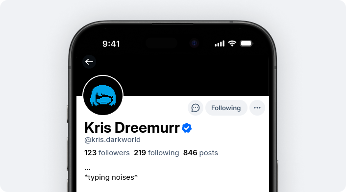

# Bluesky on Crack

Welcome friends! This is the codebase for a fork of the Bluesky Social app -
Bluesky on Crack.

### _**Third-party fork by [@kris.darkworld.download](https://bsky.app/profile/did:plc:s7cesz7cr6ybltaryy4meb6y).**_

Here's a list of crack features, consolidated into each category:

Bluesky

- [x] Disable suggested follows
- [x] Rename posts to skeets
      ([idea & core implementation from witchsky](https://tangled.org/jollywhoppers.com/witchsky.app/commit/d5bdcf84f80034ec41b19de09bdd9a73a519e89f))
- [x] Always show the Germ DM button
- [x] Ability to bypass !hide on other user's content
- [x] Disable feed composer prompt
- [x] Pronouns & profile URLs _(this is going to be an upstream feature soon,
      the lexicon supports it)_
- [x] Alter Egos
  - [x] Alter Ego editor
  - [x] Apply Alter Egos on other users

AT Protocol

- [x] Remove labeler limit
- [x] Disable AppLabelers
- [x] Verification settings
  - [x] Custom verifiers
  - [x] Become a verifier
  - [x] Labeler trusted verifier negations

Other

- [x] "Show NUX" option
- [x] Feature gates editor
- [x] Default to our own
      [Castle Town PDS](https://castletown.darkworld.download) (definetly not a
      deltarune reference)

Anyway, with my yapping out of the way...

## Development Resources

This is a [React Native](https://reactnative.dev/) application, written in the
TypeScript programming language. It builds on the `atproto` TypeScript packages
(like [`@atproto/api`](https://www.npmjs.com/package/@atproto/api)), which are
also open source, but in
[a different git repository](https://github.com/bluesky-social/atproto).

There is a small amount of Go language source code (in `./bskyweb/`), for a web
service that returns the React Native Web application.

The [Build Instructions](./docs/build.md) are a good place to get started with
the app itself.

The Authenticated Transfer Protocol ("AT Protocol" or "atproto") is a
decentralized social media protocol. You don't _need_ to understand AT Protocol
to work with this application, but it can help. Learn more at:

- [Overview and Guides](https://atproto.com/guides/overview)
- [Protocol Specifications](https://atproto.com/specs/atp)
- [Bluesky's Blogpost on self-authenticating data structures](https://bsky.social/about/blog/3-6-2022-a-self-authenticating-social-protocol)

The app encompasses a set of schemas and APIs built in the overall AT Protocol
framework. The namespace for these "Lexicons" is `app.bsky.*`.

## Contributions

> Bluesky On Crack is a fork of Bluesky.. PRs are welcome!

**Guidelines:**

- Check for existing issues before filing a new one please.
- Stay away from PRs like...
  - Changing "Post" to "Skeet."
  - Refactoring the codebase, e.g., to replace React Query with Redux Toolkit or
    something.

## Forking guidelines

You have our blessing 🪄✨ to fork this application! However, it's very
important to be clear to users when you're giving them a fork.

Please be sure to:

- Change all branding in the repository and UI to clearly differentiate from
  Bluesky or Bluesky On Crack.
- Change any support links (feedback, email, terms of service, etc) to your own
  systems.
- Replace any analytics or error-collection systems with your own so we don't
  get super confused.

## Are you a developer interested in building on atproto?

Bluesky is an open social network built on the AT Protocol, a flexible
technology that will never lock developers out of the ecosystems that they help
build. With atproto, third-party integration can be as seamless as first-party
through custom feeds, federated services, clients, and more.

## License (MIT)

See [./LICENSE](./LICENSE) for the full license.

Bluesky Social PBC has committed to a software patent non-aggression pledge. For
details see
[the original announcement](https://bsky.social/about/blog/10-01-2025-patent-pledge).

## P.S.

We ❤️ you and all of the ways you support us. Thank you for making Bluesky a
great place!
